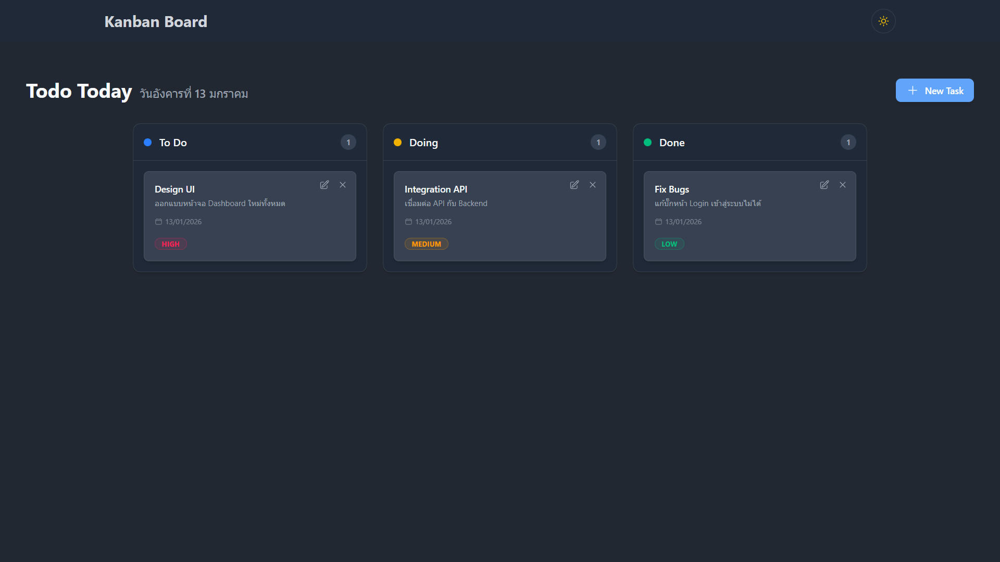
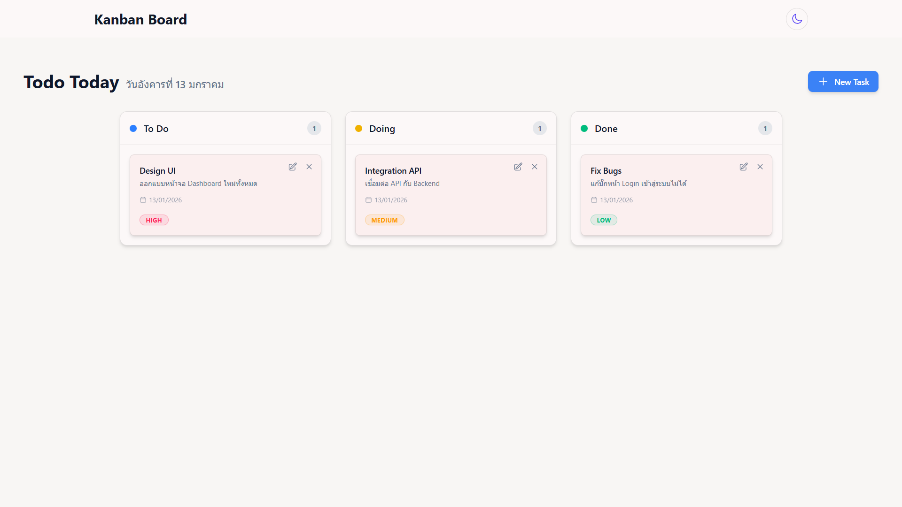

# Task Board (Kanban)

เว็บจัดการงานสไตล์ Kanban (คล้าย Trello)  
พัฒนาด้วย React เพื่อแสดงทักษะการออกแบบ Frontend, การจัดการ State และ UX

Repository:  
https://github.com/phraewchuthamat/task-board-react.git

---

## Features
- จัดการงาน 3 สถานะ: **To Do / Doing / Done**
- Drag & Drop ย้าย Task ระหว่าง Column
- เพิ่ม / แก้ไข / ลบงาน (CRUD)
- Popup Alert แจ้งผลการทำงาน
- รองรับ Dark / Light Theme
- มี **ข้อมูลเริ่มต้น (Initial Data)** สำหรับทดลองใช้งาน สามารถลบออกได้ทั้งหมด

---

## วิธีการใช้งาน (How to Use)
1. กดปุ่ม **New Task** เพื่อสร้างงานใหม่
2. กรอก Title, Description และ Priority
3. ใช้ **Drag & Drop** ลากการ์ดไปยัง Column อื่น
4. กด ✏️ เพื่อแก้ไขงาน
5. กด ❌ เพื่อลบงาน (มี Confirm)
6. งานจะเปลี่ยนสถานะตาม Column ที่อยู่

---

## State Management
- ใช้ **React `useReducer`** จัดการ CRUD
- Action ที่รองรับ:
  - ADD_TASK
  - UPDATE_TASK
  - DELETE_TASK
  - CLEAR_TASKS
- โครงสร้างถูกออกแบบให้แยก logic ออกจาก UI (SRP)

---

## Tech Stack
- **React 18 + Vite**
- **Tailwind CSS**
- **@dnd-kit** (Drag & Drop)
- **react-hook-form**
- **Headless UI**
- **Heroicons**

---

## วิธีการติดตั้ง (Installation)

### 1. Clone Repository
```bash
git clone https://github.com/phraewchuthamat/task-board-react.git
```


### 2. เข้าโฟลเดอร์โปรเจ็ค
```bash
cd task-board-react
```


### 3. ติดตั้ง dependencies
```bash
npm install
```


### 4. รันโปรเจ็ค
```bash
npm run dev
```

## Preview

### Dark Mode
<details> <summary style="cursor:pointer">📸 Click to view Dark Mode</summary> <p align="center">  </p> </details>

### Light Mode
<details> <summary style="cursor:pointer">📸 Click to view Light Mode</summary> <p align="center">  </p> </details>
